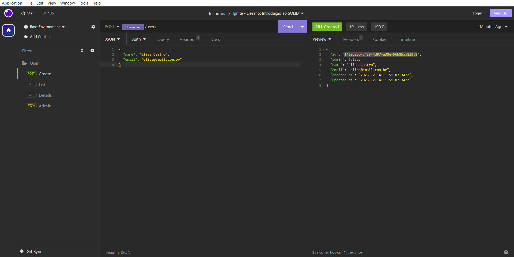

<h1 align="center">
  
</h1>

<h3 align="center">
  Desafio: Introdução ao SOLID
</h3>

<p align="center">Criação de uma aplicação de listagem e cadastro de usuários utilizando o Node.js e seguindo a estrutura de arquitetura limpa</p>

<p align="center">
  <a href="#como-executar-o-projeto">Como executar o projeto</a>&nbsp;&nbsp;&nbsp;|&nbsp;&nbsp;&nbsp;
  <a href="#sobre-o-desafio">Sobre o Desafio</a>
</p>

<p align="center">Back-end</p>

<p align="center">
  
</p>

## Como executar o projeto

### Clonar este repositório

```bash
git clone https://github.com/eliasmcastro/rocketseat-ignite-nodejs-desafio-introducao-ao-SOLID.git
```

### Requisitos

- [Node.js](https://nodejs.org)
- [Yarn](https://yarnpkg.com)

#### Opcional

- [Insomnia](https://insomnia.rest)

### Passos para a execução

**1. Executar aplicação**

Instalar as dependências do projeto

```bash
yarn
```

Iniciar o servidor de desenvolvimento

```bash
yarn dev
```

A aplicação começará a ser executada em http://localhost:3333

_Dica: utilizar o Insomnia para testar as rotas_

- Abrir o Insomnia -> Application -> Preferences -> Data -> Import Data -> From File -> Selecionar o arquivo insomnia.json

### Testes automatizados

Para começar a utilizar os testes, execute o comando `yarn test`, e ele irá te retornar o resultado dos testes

_Dica: se utilizar o comando `yarn test --watchAll`, o mesmo fica realizando automaticamente os testes toda vez que o arquivo app.js é alterado_

## Sobre o desafio

### Rotas da aplicação

#### POST `/users`

A rota deve receber `name`, e `email` dentro do corpo da requisição para que seja possível cadastrar um usuário.

#### GET `/users/:user_id`

A rota deve receber, nos parâmetros da rota, o `id` de um usuário e devolver as informações do usuário encontrado pelo corpo da resposta.

#### PATCH  `/users/:user_id/admin`

A rota deve receber, nos parâmetros da rota, o `id` de um usuário e transformar esse usuário em admin.

#### GET `/users`

A rota deve receber, pelo header da requisição, uma propriedade `user_id` contendo o `id` do usuário e retornar uma lista com todos os usuários cadastrados. O `id` deverá ser usado para validar se o usuário que está solicitando a listagem é um admin. O retorno da lista deve ser feito apenas se o usuário for admin.

### Documentando com Swagger

#### Preparando ambiente para documentação

- Instalar a lib `swagger-ui-express`;
- Criar um arquivo JSON para você escrever a documentação na especificação OpenAPI 3.0;
- Instanciar na sua aplicação uma rota `api-docs` que vai servir a sua documentação.

#### O que eu devo documentar?

- Informações gerais da API (nome, descrição, etc.);
- Rotas;
- Parâmetros;
- Corpo da Requisição;
- Respostas de sucesso;
- Respostas de erro;
- Exemplos.

### Específicação dos testes

#### Teste do model

- **Should be able to create an user with all props**

Para que esse teste passe, você deve completar o código do model de usuários que está em src/modules/users/model/User.ts. O usuário deve ter as seguintes propriedades:

```jsx
{
  id: string;
  name: string;
  admin: boolean;
  email: string;
  created_at: Date;
  updated_at: Date;
}
```

Lembre que a propriedade `admin` deve sempre ser iniciada como `false` e o `id` deve ser um `uuid` gerado automaticamente.

#### Testes do repositório

- **Should be able to create new users**

Para que esse teste passe, é necessário que o método `create` do arquivo **src/modules/users/repositories/implementations/UsersRepository** permita receber o `name` e `email` de um usuário, crie um usuário a partir do model.

- **Should be able to list all users**

Para que esse teste passe, é necessário que o método `list` do arquivo **src/modules/users/repositories/implementations/UsersRepository** retorne a lista de todos os usuários cadastrados na aplicação.

- **Should be able to find user by ID**

Para que esse teste passe, é necessário que o método `findById` do arquivo **src/modules/users/repositories/implementations/UsersRepository** receba o `id` ****de um usuário e ****retorne o usuário que possui o mesmo `id`.

- **Should be able to find user by e-mail address**

Para que esse teste passe, é necessário que o método `findByEmail` do arquivo **src/modules/users/repositories/implementations/UsersRepository** receba o `email` ****de um usuário e ****retorne o usuário que possui o mesmo `email`.

- **Should be able to turn an user as admin**

Para que esse teste passe, é necessário que o método `turnAdmin` do arquivo **src/modules/users/repositories/implementations/UsersRepository** receba o objeto do usuário completo, mude a propriedade `admin` para `true`, atualize também a propriedade `updated_at`  e retorne o usuário atualizado.

#### Testes de useCases

- **Should be able to create new users**

Para que esse teste passe, é necessário que o método `execute` do arquivo **src/modules/users/useCases/createUser/CreateUserUseCase.ts** receba `name` e `email` do usuário a ser criado, crie o usuário através do método `create` do repositório e retorne o usuário criado.

- **Should not be able to create new users when email is already taken**

Para que esse teste passe, é necessário que o método `execute` do arquivo **src/modules/users/useCases/createUser/CreateUserUseCase.ts** não permita que um usuário seja criado caso já exista um usuário com o mesmo email e, nesse caso, lance um erro no seguinte formato:

```jsx
{
  throw new Error("Mensagem do erro");
}
```

- **Should be able to turn an user as admin**

Para que esse teste passe, é necessário que o método `execute` do arquivo **src/modules/users/useCases/turnUserAdmin/TurnUserAdminUseCase.ts** receba o `id` de um usuário, chame o método do repositório que transforma esse usuário em administrador e retorne o usuário após a alteração.

- **Should not be able to turn a non existing user as admin**

Para que esse teste passe, é necessário que o método `execute` do arquivo **src/modules/users/useCases/turnUserAdmin/TurnUserAdminUseCase.ts** não permita que um usuário que não existe seja transformado em admin. Caso o usuário não exista, lance um erro no seguinte formato:

```jsx
{
  throw new Error("Mensagem do erro");
}
```

- **Should be able to get user profile by ID**

Para que esse teste passe, é necessário que o método `execute` do arquivo **src/modules/users/useCases/showUserProfile/ShowUserProfileUseCase.ts** receba o `id` de um usuário, chame o método do repositório que busca um usuário pelo `id` e retorne o usuário encontrado.

- **Should not be able to show profile of a non existing user**

Para que esse teste passe, é necessário que o método `execute` do arquivo **src/modules/users/useCases/showUserProfile/ShowUserProfileUseCase.ts** não permita que um usuário que não existe seja retornado. Caso o usuário não exista, lance um erro no seguinte formato:

```jsx
{
  throw new Error("Mensagem do erro");
}
```

- **Should be able to list all users**

Para que esse teste passe, é necessário que o método `execute` do arquivo **src/modules/users/useCases/listAllUsers/ListAllUsersUseCase.ts** chame o método do repositório que retorna todos os usuários cadastrados e retorne essa informação.

- **Should not be able to a non admin user get list of all users**

Para que esse teste passe, é necessário que o método `execute` do arquivo **src/modules/users/useCases/listAllUsers/ListAllUsersUseCase.ts** receba o `id` de um usuário e retorne a listagem de usuários cadastrados na aplicação apenas se o `id` recebido pertencer a um usuário admin. Caso o usuário não seja admin, lance um erro no seguinte formato:

```jsx
{
  throw new Error("Mensagem do erro");
}
```

- **Should not be able to a non existing user get list of all users**

Para que esse teste passe, é necessário que o método `execute` do arquivo **src/modules/users/useCases/listAllUsers/ListAllUsersUseCase.ts** não permita que um usuário que não exista, acesse a listagem de usuários cadastrados na aplicação. Caso o usuário não exista, lance um erro no seguinte formato:

```jsx
{
  throw new Error("Mensagem do erro");
}
```

#### Testes das rotas

Rota - [POST] /users

- **Should be able to create new users**

Para que esse teste passe, usando o useCase apropriado, você deve permitir que a rota crie um usuário e retorne um status `201` junto ao objeto do usuário criado.

- **Should not be able to create new users when email is already taken**

Para que esse teste passe, caso algum erro tenha acontecido no useCase, retorne a resposta com status `400` e um json com um objeto `{ error: "mensagem do erro" }`, onde o valor da propriedade `error` deve ser a mensagem lançada pelo erro no useCase.

Rota - [GET] /users/:user_id

- **Should be able to get user profile by ID**

Para que esse teste passe, usando o useCase apropriado, você deve permitir que a rota receba o `id` de um usuário pelo parâmetro na rota e retorne, no corpo da resposta, o objeto do usuário encontrado.

- **Should not be able to show profile of a non existing user**

Para que esse teste passe, caso algum erro tenha acontecido no useCase, retorne a resposta com status `404` e um json com um objeto `{ error: "mensagem do erro" }`, onde o valor da propriedade `error` deve ser a mensagem lançada pelo erro no useCase.

Rota - [PATCH] /users/:user_id/admin

- **Should be able to turn an user as admin**

Para que esse teste passe, usando o useCase apropriado, você deve permitir que a rota mude um usuário padrão para um admin e retorne o usuário alterado no corpo da resposta.

- **Should not be able to turn a non existing user as admin**

Para que esse teste passe, caso algum erro tenha acontecido no useCase, retorne a resposta com status `404` e um json com um objeto `{ error: "mensagem do erro" }`, onde o valor da propriedade `error` deve ser a mensagem lançada pelo erro no useCase.

Rota - [GET] /users

- **Should be able to list all users**

Para que esse teste passe, usando o useCase apropriado, você deve permitir que a rota receba o `id` de um usuário **admin** pelo header `user_id` da requisição e retorne, no corpo da resposta, a lista dos usuários cadastrados.

- **Should not be able to a non admin user get list of all users** / **Should not be able to a non existing user get list of all users**

Para que **esses dois testes** passem, caso algum erro tenha acontecido no useCase, retorne a resposta com status `400` e um json com um objeto `{ error: "mensagem do erro" }`, onde o valor da propriedade `error` deve ser a mensagem lançada pelo erro no useCase.
